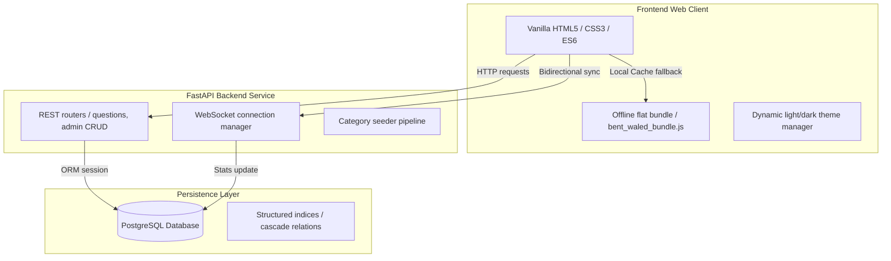
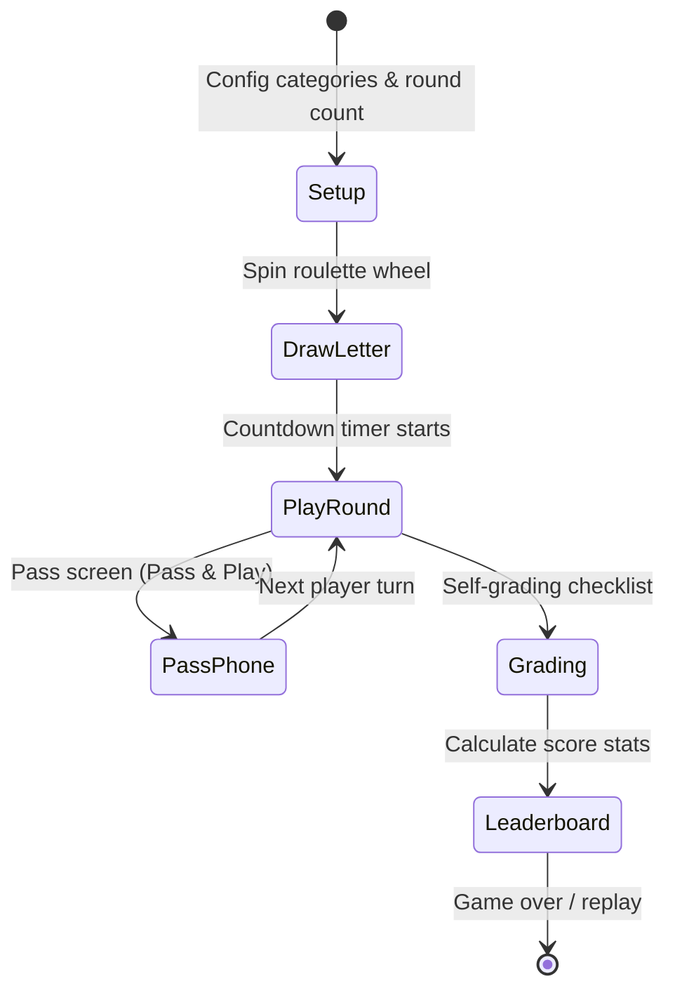

# El Quizz — V2 Platform

An interactive, high-fidelity cultural quiz platform built with a content-first architecture, local network real-time syncing, and a dual gameplay system tailored for regional and global trivia.

---

## 1. System Architecture

El Quizz V2 is organized with a clear decoupling of concerns between the **gameplay presentation client**, the **real-time orchestration server**, and the **source-of-truth database tier**.



---

## 2. Directory Layout & Organization

The repository follows a clean and structured layout:

```
├── .agents/                    # Workspace-specific agent customizations & guidelines
├── backend/                    # ASGI FastAPI Server Backend
│   ├── core/                   # Application configurations & AI generator utils
│   ├── routers/                # Modular REST routers (questions, auth, dictionary)
│   ├── database.py             # SQLAlchemy engine & session dependency
│   ├── models.py               # ORM tables declarations (cascade configs, constraints)
│   ├── schema.sql              # Database indices, tables definitions & views
│   └── seed.py                 # Core seeding scripts (Talla3 questions)
├── docs/                       # Architectural specs & Legacy records
│   ├── BENT_WALED_ARCHITECTURE.md
│   └── Al_Quizz_V1_Documentation.md
├── web_poc/                    # Client Game Dashboard & Web Assets
│   ├── content/                # Static dictionary fallback cache (bent_waled_bundle.js)
│   ├── admin.html              # Admin panel interface
│   ├── admin_app.js            # Admin interface dynamic bindings
│   ├── index.html              # Main gameplay dashboard
│   ├── app.js                  # Main clientside runtime & localized game engines
│   ├── style.css               # Dark/Light responsive stylesheets
│   └── admin_style.css         # Admin custom stylesheet
└── .gitignore                  # Git repository exclusion file
```

---

## 3. Game Modes

### 🔢 Mode 1: Talla3 9 (طلّع 9)
Players are presented with a cultural question containing **10 possible answers** (9 correct answers and 1 trap/distracter). Teams must guess all 9 correct choices while avoiding the trap.
* **Scoring**: Awarded scores follow a Fibonacci sequence ($1, 2, 3, 5, 8$) to reward high momentum correct guess streaks.
* **Real-time Sync**: Coordinating turns, buzzers, and scoreboard graphs concurrently across multiple clients using WebSockets.

### 👦👧 Mode 2: Bent Waled (بنت ولد)
A classic offline-first word game where players must name a *Boy, Girl, Country, Animal, Object, Plant, Profession, and Food* starting with a randomly drawn letter.
* **State Machine Flow**:


---

## 4. Key Architectural Optimizations

1. **Light & Dark Theme Parity**: Includes a customized, Mediterranean-sage theme palette. Dynamic toggling switches styles instantly and persists choice in `localStorage`.
2. **Offline-First Dictionary Cache**: Employs a local cache flat file ([bent_waled_bundle.js](web_poc/content/bent_waled_bundle.js)) mapping all 28 Arabic letters in 8 categories, ensuring offline zero-latency validation without querying the DB.
3. **Database Performance Indexing**: Schema includes high-performance compound indices on the dictionary tables for immediate character search lookups.

---

## 5. Quick-Start Guide

### Backend Service Setup
1. Navigate to the `backend/` directory.
2. Configure your environment credentials in a `.env` file (copied from `.env` template).
3. Run the migrations:
   ```bash
   psql -U postgres -d el_quizz -f schema.sql
   ```
4. Seed default datasets:
   ```bash
   python seed.py
   ```
5. Launch the application:
   ```bash
   uvicorn main:app --host 0.0.0.0 --port 8000 --reload
   ```

### Frontend Client Setup
Serve the `web_poc/` folder using any static HTTP server (e.g. Live Server in VS Code, python http.server, or Nginx). Ensure your backend client configurations in `app.js` point to your backend hosting IP binding.
