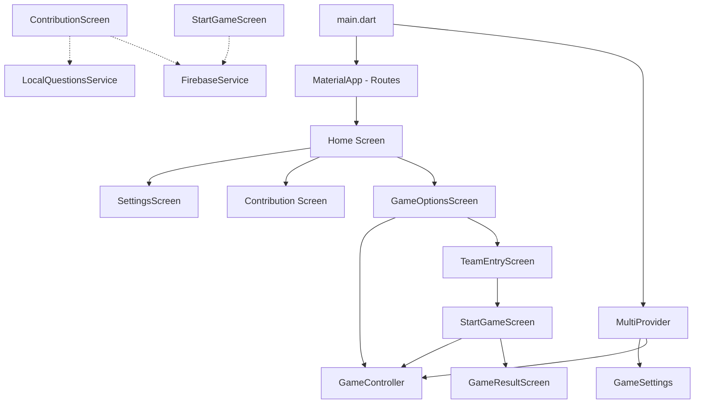

# Al Quizz — V1 Project Architecture & Specification Documentation

This document serves as the comprehensive analysis and architectural roadmap for **Al Quizz (V1)**. It maps the current local multiplayer codebase (V0, located in the `V1` directory) against the new product specifications for the online social trivia game, outlining a detailed gap analysis and step-by-step implementation plan.

---

## 1. Executive Summary

**Al Quizz** is a social trivia game tailored for the Arab world, the MENA region, and its global diaspora. Its core value proposition is: **"Play quizzes that understand who you are."**

The game dynamically adapts question content to players' culture, region, generation, language, and interests, creating a more personalized and culturally relevant experience than generic trivia apps.

*   **Current State (V0):** A local, turn-based multiplayer hot-seat quiz game (where players or teams pass the device to answer questions in rounds under the control of a "Judge"). It utilizes Firebase Firestore as a read-only cached content source and saves question suggestions in a local file-based database.
*   **Target State (V1):** An online, real-time multiplayer social trivia app (2 to 8 players) with synchronized rounds, matchmaking (Quick Match/Friends Rooms), adaptive difficulty (Momentum System), and user profile progression, powered by a FastAPI backend (WebSockets) and a PostgreSQL database.

---

## 2. Current Codebase Analysis (V0)

The current codebase is located in the [V1/](file:///d:/2_PROJECTS/DEV%20PROJECTS/EL%20QUIZZ/V1) directory. It is structured as a standard Flutter project.



### 2.1 File & Directory Directory Structure
*   **[main.dart](file:///d:/2_PROJECTS/DEV%20PROJECTS/EL%20QUIZZ/V1/lib/main.dart)**: The application entry point. Initializes Firebase, sets up Firestore offline persistence, and runs the root `MyApp` widget wrapped in a `MultiProvider` supplying the state controllers.
*   **`lib/config/`**:
    *   `responsive_size.dart`: Utilities (`SizeConfig`) for building responsive UI dimensions on various mobile device screen sizes.
*   **`lib/constants/`**:
    *   `GameOptions.dart`, `custom_icons.dart`, `theme.dart`, `buttonDefault.dart`: Predefined color tokens, icons, typography styles, and audio asset paths.
*   **`lib/models/`**:
    *   `player.dart`: Model for keeping track of a team/player name and score.
    *   `question.dart`: Model holding the question description (text), list of answers, and timer length.
    *   `question_suggestion.dart`: Model representing a user-contributed question suggestion (with fields for category, subcategory, difficulty, culture, etc.) and active state.
    *   `GameOptions/CategoryModel.dart`, `GameOptions.dart`, `Sub_Category.dart`: Data structures for game settings, active question lists, and team lists.
*   **`lib/providers/`**:
    *   `game_controller.dart`: `ChangeNotifier` managing the local turn-based game loop, team turn rotation, current round, scores, and timer state.
    *   `game_settings.dart`: `ChangeNotifier` storing audio configurations (SFX/Music volumes) and application language preferences.
*   **`lib/services/`**:
    *   `audio_service.dart`: Media player controls using the `audioplayers` package.
    *   `firebase_service.dart`: Cloud Firestore interaction. Handles categories, subcategories, cultures, and question querying (using local caching). Also manages adding/deleting suggested questions.
    *   `localquestions_service.dart`: A local storage wrapper using `localstorage` to cache user suggestions and toggle active states.
*   **`lib/screens/`**:
    *   `home/home.dart`: Main dashboard screen containing buttons to start a game, view scores, or open the question contribution panel.
    *   `game_options/`:
        *   `GameOptions.dart`: Screen for selecting game category, subcategory, difficulty, number of rounds, and time limits.
        *   `TeamEntery.dart`: Input screen to define team names and count before playing.
    *   `start_game/start_game.dart`: The core gameplay screen. Shows active questions, team indicators, countdown timers, and answer options.
    *   `game_result/game_result.dart`: Displays final scores and rankings of teams once all rounds are complete.
    *   `contribution/contribution.dart`: Form for creating question suggestions and checking local storage caches.
    *   `settings/settings.dart`: Dialog for adjusting sound volumes and app language.

---

## 3. Gap Analysis: V0 vs. V1 Spec

To transition the application from the current local version (V0) to the real-time social trivia app (V1), we need to address several fundamental architectural differences.

| Feature Area | Current Implementation (V0) | Target Specification (V1) | Gap & Work Required |
| :--- | :--- | :--- | :--- |
| **Network & Architecture** | Local / Offline caching via Firebase SDK directly in Flutter. | Real-time synchronized Client-Server model using **FastAPI + WebSockets**. | High. Need to build a separate backend server, implement WebSocket connections in Flutter, and route all game state updates through the server. |
| **Database** | Firestore Collections (Categories, Questions, Suggestions). | **PostgreSQL** relational database. | Medium. Need to design SQL schema matching the current models and migrate Firestore fetching to FastAPI endpoints. |
| **Multiplayer Mode** | Hot-seat local turn-taking (1 device passed around, teams take turns answering distinct questions). | Real-time synchronized multiplayer (2 to 8 players answering the **same** questions simultaneously). | High. Completely rewrite the game loop. Questions are sent to all clients concurrently, timers run in parallel, and scores are updated simultaneously. |
| **Gameplay Flow** | Dynamic number of rounds and questions selected by a local Judge. | Fixed **5 rounds, 5 questions per round** (25 total). Average game length: 5–10 mins. | Low. Update game loop constants and remove custom round selectors. |
| **Scoring Model** | Binary correct/incorrect points. | Correct (+100 pts), **Speed Bonus** (+0 to 50 pts based on time left), Wrong (0 pts). | Low. Update score calculations using response timestamps. |
| **Difficulty & Adaptation** | Static difficulty level chosen at game setup. | **Momentum System**: Adaptive difficulty (leader gets slightly harder questions, trailing players get slightly easier ones). | Medium. Implement difficulty weight adjustments on the backend question dispatcher. |
| **Game Modes** | Custom filtering by categories and subcategories. | **Persona Mode** (predefined profiles like Gen Z Tunisia, Maghreb Diaspora, Geek) and **Custom Mode** (manual filtering). | Medium. Define Persona configurations (maps of category weights/regions/generations) and query conditions. |
| **Lobbies & Social** | None. | **Friends Room** (Code/Link sharing, max 8 players) and **Quick Match** (matchmaking based on language + region). | High. Implement matchmaking queues and room state machines on the FastAPI backend. |
| **Profiles & Progression** | Simple local settings. | Profiles (Username, Country, Stats), **XP Progression** (Levels, Streaks, Wins), and cosmetics (Unlocking Titles, Borders, Badges). | Medium. Create profile database tables, progression logic, and UI display cards. |
| **Monetization** | Free. | Free tier + **Premium Subscription** (€2.99/mo) unlocking exclusive personas, stats, themes, and badges. | Medium. Integrate payment gateways (Stripe/App Store purchases) and premium flag checks. |

---

## 4. Technical Architecture for V1

To support Al Quizz V1, we will implement a backend-driven architecture. The Flutter mobile app will act as a thin client displaying state synced over WebSockets.

```
+-------------------------------------------------------------+
|                     Flutter Mobile App                      |
|  +-------------------+  +--------------------------------+  |
|  |     UI Screen     |  |       State Management         |  |
|  | (Widgets & Views) |  |   (Riverpod/Provider State)    |  |
|  +---------+---------+  +----------------+---------------+  |
|            |                             |                  |
+------------|-----------------------------|------------------+
             | REST API                    | WebSockets
             v                             v
+-------------------------------------------------------------+
|                       FastAPI Backend                       |
|  +-------------------+  +--------------------------------+  |
|  |  REST Endpoints   |  |        WebSocket Manager       |  |
|  | (Auth, Profiles)  |  |  (Lobbies, Matchmaking, Loops) |  |
|  +---------+---------+  +----------------+---------------+  |
|            |                             |                  |
+------------|-----------------------------|------------------+
             +--------------+--------------+
                            | SQLAlchemy ORM
                            v
+-------------------------------------------------------------+
|                     PostgreSQL Database                     |
|  +-------------------------------------------------------+  |
|  | Tables: Users, Questions, Lobbies, Stats, Progression |  |
|  +-------------------------------------------------------+  |
+-------------------------------------------------------------+
```

### 4.1 Target Database Schema (PostgreSQL)

To support the cultural categories and progression system, we will design the database with the following structure:

```sql
-- Users & Profiles
CREATE TABLE users (
    id SERIAL PRIMARY KEY,
    username VARCHAR(50) UNIQUE NOT NULL,
    email VARCHAR(100) UNIQUE NOT NULL,
    hashed_password VARCHAR(100) NOT NULL,
    country VARCHAR(50) NOT NULL,
    preferred_language VARCHAR(10) NOT NULL,
    xp INTEGER DEFAULT 0,
    level INTEGER DEFAULT 1,
    is_premium BOOLEAN DEFAULT FALSE,
    created_at TIMESTAMP DEFAULT CURRENT_TIMESTAMP
);

-- Question Repository
CREATE TABLE questions (
    id SERIAL PRIMARY KEY,
    text TEXT NOT NULL,
    options JSONB NOT NULL, -- ["Opt A", "Opt B", "Opt C", "Opt D"]
    correct_option INTEGER NOT NULL, -- Index 0-3
    category VARCHAR(50) NOT NULL,
    subcategory VARCHAR(50),
    region VARCHAR(50) NOT NULL, -- e.g., "Tunisia", "MENA", "Global"
    language VARCHAR(10) NOT NULL, -- "fr", "ar", "en"
    difficulty INTEGER NOT NULL, -- 1 (Easy) to 5 (Hard)
    generation VARCHAR(30), -- "Gen Z", "Golden", "All"
    created_by INTEGER REFERENCES users(id) ON DELETE SET NULL,
    is_approved BOOLEAN DEFAULT FALSE
);

-- User Statistics
CREATE TABLE user_stats (
    user_id INTEGER PRIMARY KEY REFERENCES users(id) ON DELETE CASCADE,
    games_played INTEGER DEFAULT 0,
    games_won INTEGER DEFAULT 0,
    win_rate REAL DEFAULT 0.0,
    favorite_category VARCHAR(50),
    total_points INTEGER DEFAULT 0,
    current_streak INTEGER DEFAULT 0
);
```

### 4.2 Game Loop & Real-time Sync (WebSockets)

A state machine on the backend server handles match state and pushes events to all connected clients in the same lobby.

```
       +--------------------------------------------+
       |                  Lobby                     |
       |  (Wait for 2-8 players / host starts game) |
       +---------------------+----------------------+
                             |
                             v
       +--------------------------------------------+
       |               Start Round                  |
       |  (Sync round index, fetch 5 questions)      |
       +---------------------+----------------------+
                             |
                             v
       +--------------------------------------------+
       |             Question Broadcast             | <----------+
       |  (Send question, start 10s countdown)       |            |
       +---------------------+----------------------+            |
                             |                                    |
                             v                                    |
       +--------------------------------------------+            |
       |             Collect Answers                |            |
       |  (Wait for all inputs or timer expiration)  |            |
       +---------------------+----------------------+            |
                             |                                    |
                             v                                    |
       +--------------------------------------------+            | Repeat 5x
       |             Reveal Answer                  |            | per round
       |  (Show correct option, calculate points)   |            |
       +---------------------+----------------------+            |
                             |                                    |
                             v                                    |
       +--------------------------------------------+            |
       |            Round Leaderboard               |            |
       |  (Show active scores & momentum adjustment) | -----------+
       +---------------------+----------------------+
                             |
                             v (After 5 Rounds)
       +--------------------------------------------+
       |                 Game Over                  |
       | (Final scores, level ups, XP calculation)  |
       +--------------------------------------------+
```

---

## 5. Development Implementation Roadmap

To build Al Quizz V1, we will divide the development lifecycle into five targeted phases.

### Phase 1: Environment & PDF Seeding
1.  **Environment Setup:** Add the local Flutter SDK located at `C:\flutter\bin` to user system environment paths for seamless builds.
2.  **PDF Parser Script:** Create a Python/Dart parser to extract the 14 project management questions from the case study PDF.
3.  **Local Mock Database:** Generate a `questions_seed.json` containing the extracted questions and standard categories to populate the application local cache.

### Phase 2: Refactoring Flutter Models & UI
1.  **Refactor Models:** Update `question.dart`, `player.dart`, and `GameOptions.dart` to support categories, subcategories, region, language, and difficulty metrics.
2.  **Add Profile & Progression UI:** Build profile display pages, level progress bars, and badges.
3.  **Persona & Custom Mode UI:** Redesign the Game Configuration screen to support Persona selections (such as "Gen Z Tunisia", "Maghreb Diaspora") and custom option filtering.

### Phase 3: REST & Database API
1.  **FastAPI Backend Initialization:** Create a basic FastAPI directory layout.
2.  **PostgreSQL Setup:** Configure database models using SQLAlchemy ORM.
3.  **Authentication & Profile Endpoints:** Implement API endpoints for user signup, login, updating statistics, and loading profile data.

### Phase 4: WebSockets & Real-time Matches
1.  **WebSocket Manager:** Write backend logic in FastAPI to handle rooms, active connections, and broadcast match configurations.
2.  **Matchmaking Queue:** Create matchmaking logic on the server to pair players with identical region/language attributes.
3.  **Mobile Client Sync:** Connect the Flutter application to backend WebSockets, updating the local Riverpod/Provider game state based on events received from the server.

### Phase 5: Polishing, Monetization, & Audio
1.  **Momentum System:** Write the adaptive difficulty selection script on the backend.
2.  **Premium Features:** Add premium badge icons, exclusive theme selections, and mock subscription checkout flows.
3.  **SFX Integration:** Connect gameplay events (timer ticking, correct answers, wins) to the `audioplayers` audio service.
